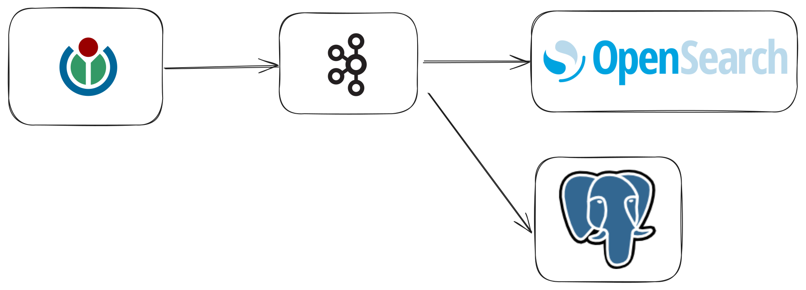

# Description
A demo project to practice kafka using wikimedia as a source and java as a language following the instructions in the course [Apache Kafka Series - Learn Apache Kafka for Beginners v3](https://www.udemy.com/course/apache-kafka)

## Why I did this project?
I created this project to learn how kafka could be applied inside a java project and how to do use kafka with good practices.

## Future work
This project will be replicated in python

# Design
